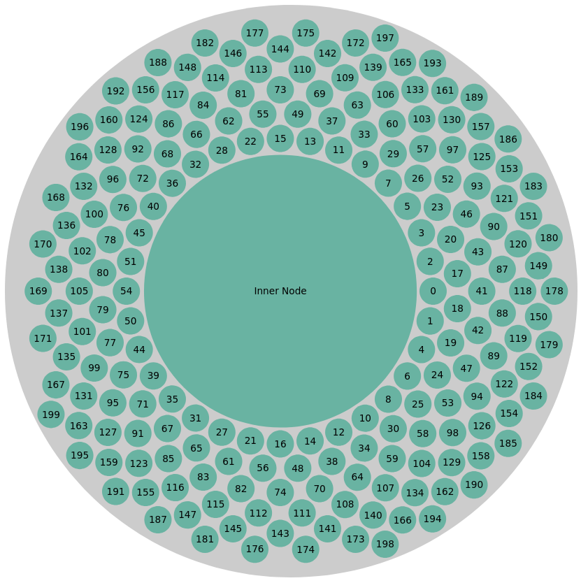
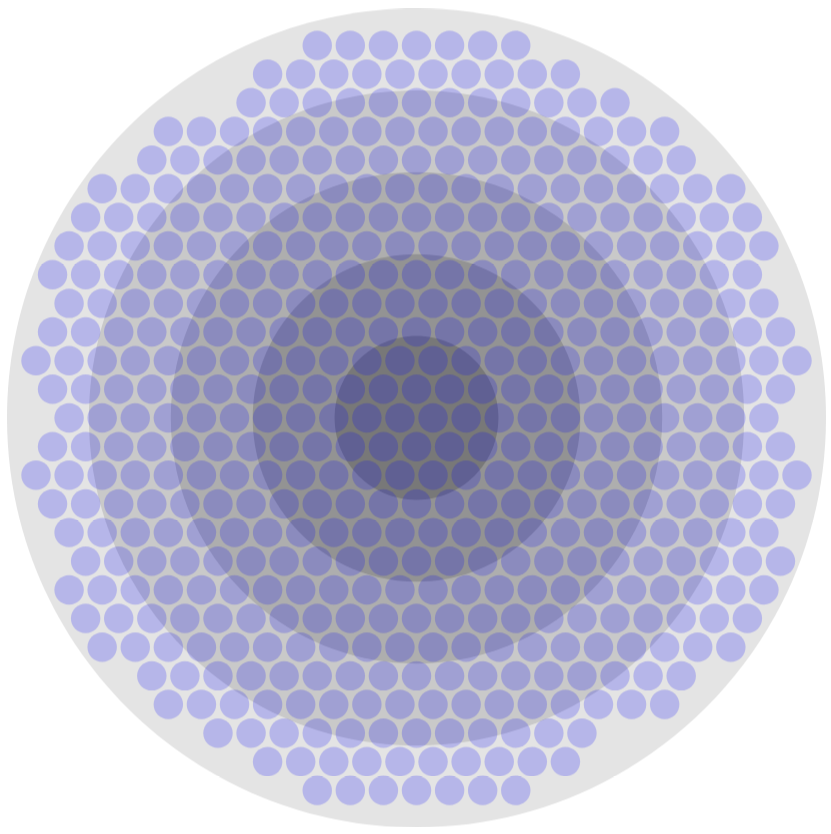
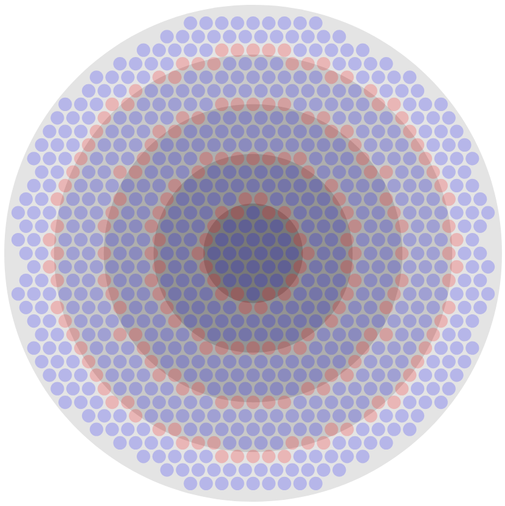
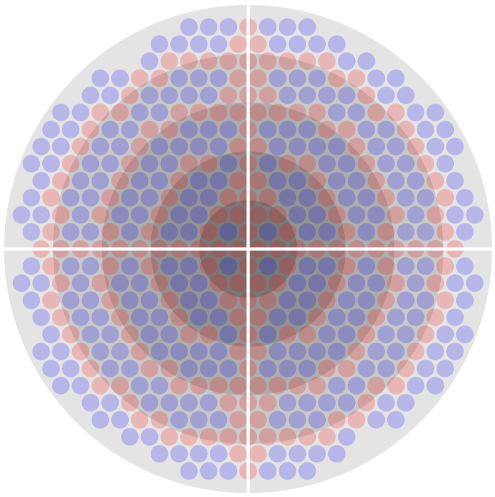

# Bin Packing Example with D3.js

This project demonstrates a bin packing visualization using D3.js. The visualization creates a series of nested circles (representing layers) and randomly places nodes within these layers. The valid nodes are then tracked and displayed based on their positions in the top right quarter of the canvas.

## Features

- **Dynamic Circle Packing**: Visualizes nested circles with varying radii.
- **Node Visualization**: Displays nodes in the top right quarter of the canvas.
- **Interactive Lookup Table**: Tracks the positions of valid nodes in a structured lookup table.

## Installation

1. Designed to be used in JSFiddle.net. Add the [D3.js](https://cdnjs.cloudflare.com/ajax/libs/d3/7.0.0/d3.min.js) resource.
2. Copy the jsfiddle.js code into the JavaScript section.

## Usage

After opening the project, you will see a visualization with nested circles. Valid nodes are drawn in blue, while invalid are drawn in red. An invalid node is one that is located on a border.

### Screenshots

| Screenshot | Description                                                                                                |
|------------|------------------------------------------------------------------------------------------------------------|
|  | Initial test to create an inner layer using a node. This didn't work as node positions can not be defined. |
|  | Layers added per project requirements.                                                                     |
|  | Invalid nodes are detected and highlighted.                                                                |
|  | H and v lines added per project requirements. Invalid nodes are also highlighted for these borders.        |

## Code Overview

The main components of the code include:

- **Data Generation**: Generates a specified number of markers (nodes) to be displayed.
- **Layer Drawing**: Draws concentric circles representing different layers.
- **Node Placement**: Places nodes randomly and checks their validity based on proximity to layer borders.
- **Lookup Table**: Organizes valid node positions for easy access and visualization.

## Technologies Used

- [D3.js](https://d3js.org/) - JavaScript library for producing dynamic, interactive data visualizations.
- HTML/CSS - Basic structure and styling of the web page.

## License

This project is licensed under the MIT License - see the [LICENSE](LICENSE) file for details.

## Acknowledgments

- Thanks to the D3.js community for their excellent documentation and examples.
- Inspiration from various bin packing visualizations available online.